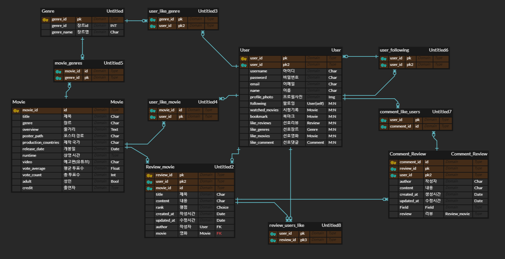

# No.456 - (Final_Project)

#### 서비스 대표 이미지


## 0. 사전 필요 코드, Command

```
# Vue
npm install
npm run serve
```

```
# Django
pip install -r requirments.txt
python manage.py makemigrations
python manage.py migrate
python manage.py runserver
```


--------------------------------------

#### 아키텍처

- Django REST API 서버 & Vue.js


#### 개발환경

- python - 3.9.6

- Django - 3.2.6
- djangorestframework - 3.12.4
- python-decouple - 3.5
- djangorestframework-simplejwt - 5.0.0
- django-cors-headers - 3.10.0

- Node.js LTS


- Vue.js - 2.6.11
- vuex - 3.4.0
- vuetify - 2.4.0
- vue-router - 3.2.0
- lodash - 4.17.21
- axios - 0.24.0
- vue-infinite-loading - 2.4.5
- vue-scratchable - 0.3.3
- aos - 2.3.4
- vue-chartjs - 3.5.1


### 📃개발 환경 및 일정 관리

- Git


- Notion


## 1. 팀원 정보

- <b>이수환 (팀장)</b>
  - <b>Vue.js, Django, Main Design, Sub Project Planning</b>


- <b>박준용</b>
  - <b>Django, Vue.js,  Sub Design, Main Project Planning</b>


## 2. 목표 서비스 구현 및 실제 구현 정도

😀**목표 : 영화 데이터 기반의 정보 제공 사이트**

##### 로그인, 로그아웃, 프로필 수정

##### 기본적인 영화 정보 조회 (장르별, 일간-주간 차트별 등), 좋아요, 영화 댓글 평점, 리뷰 작성 기능

##### 커뮤니티, 마이페이지(나의 리뷰 조회, 좋아한 영화 조회, 타임라인, 좋아하는 장르 분석 그래프 등) 기능을 함께 구현

##### 영화 추천 시스템은 투표수를 기준으로 영화 데이터를 추출하고 영화 게임 진행, 복권 형태의 추천을 달고나 게임과 접목시켜 재미요소 증가

##### 실제 웹서비스에 비견될 수 있는 완성도를 갖추기 위한 JS, CSS 기능 구현

##### vuetify 활용을 통해 다양한 형태의 서비스로 정보 제공

##### DB에 있는 영화를 기준으로 검색 기능 제공


## 3. 데이터 추출 및 데이터베이스 모델링(ERD)

- 데이터 추출 과정
  - TMDB API를 활용하여 사용할 수 있는 데이터를 추출 및 DB에 결합
  - 약 9,900개 영화 데이터 & 장르 데이터 & credit 데이터


- 에러 처리

  - 예외처리 사례 (try, except 구문으로 예외처리하고 분석)

    - TMDB API에서 빈 데이터인 경우, null값인 경우
      - pass하고 다음 부분에 대한 영화 데이터를 계속적으로 추출

    

    - 내용이 없는 경우
      - try: ~ except: 예외처리를 통해 로그에 기록하고 어떤 부분이 문제인지 분석
      - 규칙을 찾을 수 없으면 제외

- `movies2.json`


- 데이터베이스 모델링
- 개발한 영화 추천 서비스에서 모든 page를 랜더링 및 라우팅 할 때 쓸 모든 자료들을 추출하고, Django Model을 구성하여 필요 데이터를 SQLite에 연동<br> => 배포 시에는 postgreSQL 사용


##### db.sqlite3 테이블 (특정 몇 개만 선정)

- `accounts_user`

  | 필드명        | 자료형  | 설명               |
  | :------------ | ------- | ------------------ |
  | id            | Integer | Primary Key        |
  | password      | String  | 비밀번호           |
  | Last_login    | Date    | 날짜 시간          |
  | is_superuser  | Bool    | 최상위 관리자 권한 |
  | username      | String  | 유저 아이디        |
  | email         | String  | 이메일             |
  | is_staff      | Bool    | 관리자 권한        |
  | name          | String  | 유저 이름          |
  | profile_photo | String  | 유저 프로필 이미지 |

- `movies_movie`

| 필드명        | 자료형  | 설명                   |
| ------------- | ------- | ---------------------- |
| id            | Integer | Primary Key            |
| title         | String  | 영화 제목              |
| popularity    | Float   | 인기도                 |
| vote_count    | Int     | 총 투표 수             |
| vote_average  | Float   | 평균 투표 점수         |
| overview      | Text    | 줄거리                 |
| poster_path   | String  | 영화 포스터 이미지 URL |
| adult         | Bool    | 성인 유무              |
| backdrop_path | String  | 영화 백 이미지         |
| genres        | Array   | 영화 장르 pk 리스트    |

- `community_review`

| 필드명     | 자료형  | 설명                            |
| ---------- | ------- | ------------------------------- |
| id         | Integer | Primary Key                     |
| title      | String  | 리뷰 제목                       |
| content    | Float   | 리뷰 내용                       |
| rank       | Int     | 영화에 대한 리뷰에서 주는 별점  |
| created_at | Float   | 리뷰 생성 시간                  |
| updated_at | Text    | 리뷰 수정 시간                  |
| author_id  | String  | 리뷰 작성자 id (user 모델 참조) |
| movie_id   | Bool    | 리뷰 영화 id (movie 모델 참조   |





## 4. 필수 기능에 대한 설명

#### TMDB API를 사용한 영화 데이터 크롤링

- 수집한 영화 데이터 : 약 9,900개

`sample.py`

```python
...(생략)
for name in movie_list:
    try:
        url = popurlar.format_map(Default(movies=name, key=apikey))
        r = requests.get(url)
        data = json.loads(r.text)
        # print(data)

        for j in data["results"]:
            url2 = credit.format_map(Default(movie_id=j["id"], key=apikey))
            print(j["id"])
            c = requests.get(url2)
            c_data = json.loads(c.text)
            # print(c_data)
            cre = {"movie_id": j["id"]}
            cre["cast"] = c_data["cast"]
            cre["crew"] = c_data["crew"]
            ret.append(cre)
     except:
         print('pass')

json.dump(ret, json_file, ensure_ascii=False)
```

- python과 API를 활용해 영화 데이터를 Json 파일로 추출
- 서비스 배포 후, postgreSQL에 loaddata 명령어로 데이터 삽입


#### A. 관리자 뷰

- 관리자 페이지
  - 일반 유저와는 권한이 다른 관리자를 설정
  - 관리자 페이지를 통한 영화, 유저 정보 관리


#### B. 영화 정보


##### 첫번째 서비스 랜딩 페이지

- 최상단에 고정된 Nav bar와 Movie Trending, Top Rate 기준으로 영화를 보여줍니다.
- 상단에 자동 재생되는 영상은 Movie Trending에서 DAY, WEEK 기준으로 1위 영화에 대한 영상과 제목, 줄거리를 보여줍니다.
- 영화 포스터에 마우스를 호버 시키면 영화 정보와 평점 정보를 보여줍니다.

`Main.vue`

```vue
...(생략)
    <iframe
      v-if="videoId"
      class="video-player main-video"
      type="text/html"
      :src="`https://www.youtube.com/embed/${videoId.key}?autoplay=1&mute=1&loop=1&playlist=${videoId.key}`"
      frameborder="0"
      allowfullscreen
      width="100%"
      height="1080px"
    >
    </iframe>

    <div v-if="trending" class="main-movie">
      <p class="main-movie-title">{{ trending[0].title }}</p>
      <p class="main-movie-overview d-d">{{ trending[0].overview | truncate }}</p>
    </div>

    <div class="main-contents">
      <trending id="trending"></trending>
      <top-rate id="top-rate"></top-rate>
    </div>
(생략)...
```


##### 장르별 영화 페이지

- 19가지의 장르를 기준으로 영화 데이터를 보여줍니다.
- 복수의 장르를 가지고 있는 영화는 장르를 여러개 선택해 영화 검색의 정확도를 높일 수 있습니다.
- infinite-scroll을 구현해 유저의 요청에 따라 지속적으로 영화를 보여줄 수 있도록 구현했습니다.

`Movie.vue`

```vue
...(생략)
      <v-row v-else class="movie-cards">
          <movie-card 
            v-for="movie in movieList" 
            :key="movie.id"
            :movie="movie"
          ></movie-card>
      </v-row>
    </v-container>

    <infinite-loading @infinite="infiniteHandler" spinner="waveDots"></infinite-loading>
```


##### 영화 상세 페이지

- 메인 페이지, 장르별 영화 페이지 등에서 영화 포스터를 통해 각 영화의 상세 페이지로 이동이 가능합니다
- TMDB에 있는 평점 정보, 감독 및 배우 등의 정보를 가져와 정보를 제공합니다.
- 상세 정보외에도 해당 영화의 장르를 기준으로 비슷한 영화를 추천하고, 해당 영화에 대한 영상을 보여줍니다.


#### C. 추천 알고리즘


##### 영화 추천 페이지

- 페이지 내에서 Tab을 활용하여 추천 시스템을 변경할 수 있습니다.
- 선호하는 영화를 선택하는 게임과, 복권 형식의 영화 추천을 통해 사용자에게 서비스를 제공합니다.


- 영화 선택 게임을 통해서 총 32강에 해당하는 영화를 추천받고 그 중 사용자가 최종적으로 고른 영화의 장르 데이터가 사용자에게 저장됩니다.
- 복원 형식의 추천에서는 영화 포스터 위에 달고나 이미지를 추가해 일정 부분 긁어내면 해당 영화의 상세페이지로 이동합니다.


#### D. 커뮤니티

- 리뷰 작성
  - 로그인 한 유저는 평점과 코멘트 등록, 수정, 삭제 가능
  - 평점과 코멘트를 남긴 영화는 컬렉션 형태로 커뮤니티에 표시 (리뷰 작성 4개 이상 유저만)


##### 리뷰 작성 페이지

- 사용자는 리뷰 작성 시 평점과, 리뷰 제목, 리뷰 내용을 입력할 수 있습니다.


##### 리뷰 상세 페이지

- 사용자는 리뷰 상세 페이지에서 리뷰 내용을 확인 가능합니다.
- 또한 해당 리뷰에 대한 댓글들을 작성할 수 있습니다.


##### 커뮤니티 페이지

- 커뮤니티 페이지는 컬렉션 형태의 페이지로 구현되어 있습니다.
- 일정 리뷰 (4개) 이상의 글을 작성한 사용자들을 대상으로 만들어지며, 해당 컬렉션을 클릭하면 작성자의 모든 리뷰를 볼 수 있습니다.


#### E. 프로필


##### 사용자 프로필 페이지

- 사용자에 대한 정보를 확인할 수 있는 프로필 페이지입니다.
- 해당 사용자가 작성한 리뷰 게시글, 좋아요한 영화 목록 등을 확인할 수 있습니다.
- 추가적으로 해당 사용자의 좋아요한 영화 데이터, 추천 시스템을 통한 데이터 등을 통해서 사용자의 장르별 선호도를 보여줍니다.


##### 사용자 타임라인 페이지

- 사용자가 작성했던 리뷰를 기준으로 사용자의 타임라인을 보여줍니다.
- 작성된 날짜와 영화, 리뷰 게시글 등을 확인할 수 있습니다.


#### F. 스타일링

- UI/UX
  - Vuetify 라이브러리를 이용해 어플리케이션에 최적화된 디자인 구현
  - Single Page App으로 페이지 리로드 최소화
  - 상세 이미지는 하단 7. 결과 참조


## 5. 배포 서버 URL

#### No.456


##### 배포 환경

##### Client / Server


##### Server to Cloud


- https://456pjt.netlify.app/


## 6. 기타(느낀점)

- 이수환

  ```markdown
  # 어려웠던 점
  1. Vue.js와 Django API 서버 간 요청과 응답
  	Vue.js와 Django API 서버를 함께 사용하여 제대로 된 프로젝트를 진행하는 부분이 처음이라 데이터를 요청하고 응답받는 부분에서 많이 고생했습니다. serializer 사용법이 익숙하지 않다보니 불필요한 요청을 여러가지로 만들어서 다중 요청을 하는 등의 문제가 발생했었습니다.	다행이도 프로젝트를 진행하면서 점차 익숙해져 불필요한 요청을 점차적으로 줄여나갈 수 있었습니다.
  
  2. 프로필 사진 설정 및 변경
  	Django 하나만 사용하던 때와는 다르게 front framework에서 요청과 함께 image 파일을 전달하여 서버에 저장하는 부분이 굉장히 어려웠습니다. 많은 블로그와 공식문서, 유튜브까지 찾아보았지만 확실하게 해답을 찾지 못했습니다. 한 해외 유튜버의 강의를 보면서 따라한 결과 이미지 자체가 서버에 저장은 되지만 기존에 생성된 유저 정보에 적용되지 않거나 프로필 이미지정만 가진 새로운 유저가 생성되는 문제가 발생하였습니다. 이대로 포기하기 아쉬워서 고민을 하다 Formdata를 data 오브젝트에 담아 함께 전달하니 파일이 전달되지 않았기 때문임을 알게되었고 역으로 data를 Formdata에 담는 방법을 찾아 적용하였습니다. 그 결과 정상적으로 작동시킬 수 있었습니다.
  
  3. 배포
  	가장 어려웠던 부분은 배포부분이었습니다. 처음으로 배포를 진행하다보니 데이터를 로드하는 분부터 배포한 프론트와 서버를 연동하는 부분, 특히 aws의 s3를 활용하여 이미지를 업로드하고 이미지를 읽을 수 있도록 연동하는 부분이 가장 힘들었습니다. s3에 이미지는 업로드가 정상적으로 진행되었지만 출력시에 에러가 발생하였고 이를 해결하기위해 s3 접근 권한을 공개로 변경하였지만 같은 에러만 반복되었습니다. 확인 결과 서버에서 이미지 URL을 불러올 때 해당 이미지의 URL이 다르게 설정되어 불러와 지는 것을 알았고 참고했던 사이트가 아닌 다른 사이트의 정보와 같이 비교해가면서 다른 부분을 찾아 적용해보려고 노력했습니다. 그 결과 URL 주소를 설정해주는 setting을 찾아 성공적으로 불러올 수 있었습니다. 이 경험을 통해서 하나의 문서나 자료만 보는것이 아니라 여러 자료를 두고 같이 봐야겠다고 느꼈습니다.
  
  
  # 배운 점
  1. 에러발생시 대처
  	가장 많이 배울 수 있었던 부분은 에러가 발생했을 때의 대처가 어느정도 능숙해졌다는 것입니다. 에러가 발생하면 왜 에러가 나왔을까 혼자 끙끙거리기만 했던 제가 에러가 발생한 위치를 찾기위해 print나 console.log를 사용하여 발생 위치를 찾고 해당 코드를 구글링하여 각종 해외 사이트 및 공식문서를 통해서 해결해 나가는 모습을 보고 많이 성장했구나를 느낄 수 있었습니다. 이러한 경험들은 프로젝트를 진행하는 도중 다른 조에서 어려움을 겪어 도움을 요청했을 때 제가 도움을 줌으로써 문제를 해결하게 되는 결과로 이어졌습니다.
  	하지만 간혹 검색에서 도움을 받지 못하는 기능들이 있었는데 아마 검색을 잘못한 부분도 있겠지만 영화 이상형 월드컵을 구현하는데 필요한 조언을 얻지 못해서 혼자서 이런 방식이면 가능하지 않을까? 하고 로직을 구상하고 적용해 보았습니다. 처음에는 잘 적용되지 않았지만 결과적으로 잘 적용되어 동작하는 것을 보고 자료가 없다고 포기하지말고 다른 곳에서 사용했던 로직들을 잘 활용하면 명확한 자료 없이도 해결되는 문제들이 있구나를 느꼈습니다. 앞으로 다양한 에러에 직면하겠지만 이번 프로젝트처럼 최선을 다해 진행한다면 성공적으로 마무리 할 수 있겠다는 자신감을 가지게 된 프로젝트 경험이었습니다.
  ```
  
  


## 7. 결과 (이미지)


### 끝!

### 감사합니다~!!

